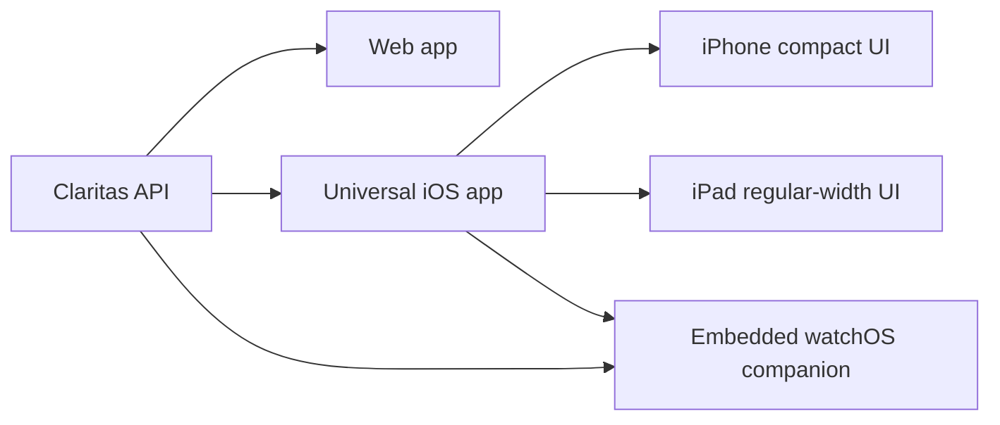

# Claritas Cross-Device Architecture and Design

This document is the source of truth for Claritas product layout across web, iPhone, iPad, and Apple Watch. It is intentionally written in Markdown so design decisions can be reviewed, versioned, and changed with the application code.

## Goals

- Keep one product model across every device: briefing, signals, markets, weather, account, and operations.
- Use platform-native navigation on each device while preserving the same information architecture.
- Keep the visual language aligned through shared color roles, spacing roles, and screen responsibilities.
- Make iPad a native regular-width experience inside the universal iOS app, not a separate product.
- Treat Apple Watch as a companion surface embedded with the iOS app, focused on fast glanceable workflows.

## Product Architecture



The iOS distribution model is one universal iOS app target with an embedded watchOS companion target.

```text
Claritas.app
  iPhone compact layout
  iPad regular-width layout
  Watch/
    Claritas Watch App.app
```

The Apple Watch app appears as a separate target/product in Xcode because it is built for watchOS, but it is distributed as companion content inside the same App Store app.

## Information Architecture

The same primary destinations exist across web, iPhone, and iPad. Watch keeps a smaller subset optimized for quick review and schedule editing.

| Area | Web | iPhone | iPad | Watch |
| --- | --- | --- | --- | --- |
| Signal desk / overview | Primary landing workspace | Dashboard summary | Primary sidebar destination | Briefing summary cards |
| Dashboard | Full workspace | First tab | Detail workspace | Metrics only |
| Daily briefing | Preferences / workspace | Tab | Sidebar destination | Page and schedule editor |
| News | Workspace | Tab | Sidebar destination | Recent headlines |
| Weather | Workspace | Tab | Sidebar destination | Current observations |
| Markets | Workspace | Tab | Sidebar destination | Market summary |
| Admin | Admin panel for admins | Admin tab for admins | Sidebar operations section | Not available |
| Profile / settings | Account menu and preferences | Profile tab | Sidebar account section | Pairing/session state only |
| Policies | Footer / account | Policies tab | Sidebar account section | Not available |

## Navigation Model

| Device class | Navigation pattern | Rationale |
| --- | --- | --- |
| Web desktop | Persistent left sidebar, sticky topbar, content workspace | Highest information density and best for repeated analysis. |
| Web mobile | Topbar with drawer, single-column content | Keeps web usable without duplicating native iOS patterns exactly. |
| iPhone | Native `TabView` with `NavigationStack` per tab | Matches expected iOS compact navigation. |
| iPad | Native `NavigationSplitView` sidebar plus detail pane | Uses the iPad regular-width idiom and avoids a stretched phone UI. |
| Watch | Vertical page `TabView` plus `NavigationStack` for detail | Fast glances, short interactions, and crown-friendly vertical movement. |

## Shared Design Tokens

All clients should use these semantic roles rather than inventing per-screen colors. Hex values come from the current web CSS and SwiftUI palette.

### Light Theme

| Role | Hex | Usage |
| --- | --- | --- |
| `shell.bg` | `#F3E9D7` | App background. |
| `shell.bgElevated` | `#E8D9C2` | Background elevation and large panels. |
| `shell.sidebar` | `#10293A` | Desktop/sidebar chrome. |
| `shell.surface` | `#FFFAF1` at 76% | Cards and low elevation surfaces. |
| `shell.surfaceStrong` | `#FFFAF1` at 94% | Raised cards, menus, dialogs. |
| `shell.surfaceMuted` | `#E9DCC8` at 78% | Secondary controls and muted panels. |
| `shell.border` | `#172F42` at 17% | Default border. |
| `shell.borderStrong` | `#172F42` at 32% | Active or high-emphasis border. |
| `shell.ink` | `#172F42` | Primary text. |
| `shell.muted` | `#53616A` | Secondary text. |
| `shell.accent` | `#E6A06A` | Primary accent and call-to-action tone. |
| `shell.accentSecondary` | `#3E6A80` | Secondary action and data tone. |
| `shell.selected` | `#F3CDAA` | Selected nav state. |
| `signal.positive` | `#2A5268` | Positive status. |
| `signal.negative` | `#A73B32` | Negative status. |

### Dark Theme

| Role | Hex | Usage |
| --- | --- | --- |
| `shell.bg` | `#0C1720` | App background. |
| `shell.bgElevated` | `#122432` | Background elevation and large panels. |
| `shell.sidebar` | `#09141D` | Desktop/sidebar chrome. |
| `shell.surface` | `#142735` at 76% | Cards and low elevation surfaces. |
| `shell.surfaceStrong` | `#1B3445` at 92% | Raised cards, menus, dialogs. |
| `shell.surfaceMuted` | `#1F394A` at 72% | Secondary controls and muted panels. |
| `shell.border` | `#C9BBA9` at 20% | Default border. |
| `shell.borderStrong` | `#C9BBA9` at 36% | Active or high-emphasis border. |
| `shell.ink` | `#F6EBDD` | Primary text. |
| `shell.muted` | `#C9BBA9` | Secondary text. |
| `shell.accent` | `#EAA36C` | Primary accent and call-to-action tone. |
| `shell.accentSecondary` | `#7FA6B8` | Secondary action and data tone. |
| `shell.selected` | `#6F4932` | Selected nav state. |
| `signal.positive` | `#7FA6B8` | Positive status. |
| `signal.negative` | `#D96B62` | Negative status. |

## Device Layouts

### Web Desktop

Target width: `1024px` and above.

```text
+---------------------------------------------------------------------+
| Sidebar                 | Topbar: section, search, alerts, theme     |
|                         +--------------------------------------------+
| Brand                   | Workspace content                          |
| - Signal desk           | +------------+ +------------+ +---------+ |
| - Dashboard             | | Metric     | | Metric     | | Metric  | |
| - Briefing              | +------------+ +------------+ +---------+ |
| - News                  | +-------------------+ +----------------+ |
| - Weather               | | Primary analysis  | | Related panel  | |
| - Markets               | +-------------------+ +----------------+ |
| - Admin                 | Footer / policy links                       |
+---------------------------------------------------------------------+
```

Rules:

- Sidebar remains visible and owns primary navigation.
- Topbar owns global actions: search, alerts, theme, account.
- Content uses a dense grid for dashboard, markets, and admin workflows.
- Cards are for individual items or panels, not for whole page sections.
- Tables and lists should keep scan-first density on desktop.

### Web Mobile

Target width: below `768px`.

```text
+------------------------------+
| Topbar: menu, brand, actions |
+------------------------------+
| Drawer navigation when open  |
+------------------------------+
| Single-column workspace      |
| +--------------------------+ |
| | Primary card / summary   | |
| +--------------------------+ |
| +--------------------------+ |
| | List row                 | |
| +--------------------------+ |
+------------------------------+
```

Rules:

- Use a drawer for primary navigation.
- Keep one task per viewport: summary, list, detail, or form.
- Preserve the same color tokens as desktop web.
- Respect safe-area insets for browser UI and installed PWA usage.

### iPhone

Target: compact horizontal size class.

```text
+------------------------------+
| Native navigation title      |
+------------------------------+
| Selected tab content         |
| Dashboard / Briefing / News  |
| Weather / Markets / Profile |
+------------------------------+
| Native tab bar               |
+------------------------------+
```

Rules:

- Use native `TabView` with `NavigationStack` per tab.
- Keep the first five everyday destinations visible: Dashboard, Briefing, News, Weather, Markets.
- Admin, Profile, and Policies may sit after primary tabs.
- Prefer native controls for forms: `Picker`, `DatePicker`, `Toggle`, `Button`.
- Avoid custom desktop-style sidebars or floating browser-like chrome on iPhone.

### iPad

Target: regular horizontal size class inside the universal iOS app.

```text
+---------------------------------------------------------------------+
| Native sidebar       | Native detail navigation title + toolbar      |
|                      +-----------------------------------------------+
| Workspace            | Detail workspace                              |
| - Signal desk        | +------------+ +------------+ +------------+ |
| - Dashboard          | | Metric     | | Briefing   | | Status     | |
| - Briefing           | +------------+ +------------+ +------------+ |
| Signals              | +----------------------+ +----------------+ |
| - News               | | Primary visualization| | Latest signals | |
| - Weather            | +----------------------+ +----------------+ |
| - Markets            |                                               |
| Operations           |                                               |
| Account              |                                               |
+---------------------------------------------------------------------+
```

Rules:

- Use `NavigationSplitView`; never present iPad as an enlarged iPhone screen.
- Sidebar groups destinations into Workspace, Signals, Operations, and Account.
- Detail content should use wider grids and side-by-side panels.
- Use native toolbar placement for theme and account controls.
- Keep colors identical to iPhone because both use the SwiftUI `ClaritasPalette`.

### Apple Watch

Target: watchOS companion app embedded in the universal iOS app.

```text
Vertical pages

+------------------+
| Briefing         |
| key takeaways    |
| schedule summary |
+------------------+
        |
        v
+------------------+
| Schedule editor  |
| enabled, time, TZ|
+------------------+
        |
        v
+------------------+
| News             |
| compact rows     |
+------------------+
        |
        v
+------------------+
| Markets          |
| compact summary  |
+------------------+
        |
        v
+------------------+
| Weather          |
| compact summary  |
+------------------+
```

Rules:

- Keep interactions under a few taps.
- Use short labels and one-column cards.
- Daily briefing and schedule editing are first-class watch workflows.
- Watch receives auth/session and cached data from iPhone where appropriate.
- Avoid admin operations, long policy pages, and dense analysis views.

## Screen Specifications

### Authentication

| Device | Layout |
| --- | --- |
| Web desktop | Centered login panel with provider buttons and brand context. |
| Web mobile | Single-column login with large provider buttons. |
| iPhone | Native sign-in screen with provider buttons. |
| iPad | Same auth flow as iPhone, centered within regular-width content. |
| Watch | Pairing/connect state only; sign-in happens on iPhone. |

### Signal Desk / Dashboard

| Device | Layout |
| --- | --- |
| Web desktop | Metrics row, map or visual analysis, latest signals, related profile panels. |
| Web mobile | Metrics stack, latest signal list, simplified visualizations. |
| iPhone | Dashboard tab with compact segmented sections. |
| iPad | Signal desk landing with metrics, daily briefing, market pulse, weather extremes, and latest news. |
| Watch | Briefing page includes small counts for news, weather, and markets. |

### Daily Briefing

| Device | Layout |
| --- | --- |
| Web desktop | Preferences/workspace card with enabled toggle, time picker, timezone picker, last run, status. |
| Web mobile | Same fields in one column. |
| iPhone | Briefing tab with published briefing and schedule editor. |
| iPad | Sidebar destination with briefing status, schedule form, and preview. |
| Watch | First page summary plus dedicated schedule editor page. |

Daily briefing form rules:

- Time must be selected from a constrained time control or dropdown, not free text.
- Timezone must be selected from known timezone options.
- Save errors should explain auth, validation, or server failures separately.
- Last run should be visible wherever the schedule is editable.

### News

| Device | Layout |
| --- | --- |
| Web desktop | Search/filter tools, provider/source tags, list/detail density. |
| Web mobile | List-first with compact filters. |
| iPhone | News tab with recent/archive controls and rows. |
| iPad | Sidebar destination with list and analysis cards. |
| Watch | Recent compact headlines only. |

### Weather

| Device | Layout |
| --- | --- |
| Web desktop | Country observations, map/bubbles, refresh controls. |
| Web mobile | Current observations list and refresh. |
| iPhone | Weather tab with country rows and refresh. |
| iPad | Weather workspace with larger charts and observation panels. |
| Watch | Compact weather observations. |

### Markets

| Device | Layout |
| --- | --- |
| Web desktop | Market status, quotes, earnings/news relation, detail panels. |
| Web mobile | Quote list and compact market status. |
| iPhone | Markets tab with quote list and selected market profile. |
| iPad | Market workspace with side-by-side market profile and related signals. |
| Watch | Compact market direction and quote summary. |

### Admin

| Device | Layout |
| --- | --- |
| Web desktop | Full admin workspace for ingestion and user management. |
| Web mobile | Available only if forms remain usable in one column. |
| iPhone | Admin tab for admins, native forms. |
| iPad | Operations section in sidebar. |
| Watch | Not available. |

## Implementation Mapping

| Area | Web | iOS/iPad | Watch |
| --- | --- | --- | --- |
| Shell and navigation | `apps/web/src/App.tsx`, `apps/web/src/index.css` | `apps/mobile/ios/Claritas/Views/RootView.swift` | `apps/mobile/ios/ClaritasWatch/Views/WatchRootView.swift` |
| Shared native palette | CSS variables in `apps/web/src/index.css` | `ClaritasPalette` in `BrandComponents.swift` | `WatchPalette` in `WatchBrand.swift` |
| Dashboard and signal views | `App.tsx` workspace sections | `DashboardView.swift`, `PadOverviewView.swift` | `WatchRootView.swift` summary pages |
| Daily briefing | Web preferences/workspace components | `DailyBriefingWorkspaceView` in `RootView.swift` | `WatchBriefingView`, `WatchBriefingScheduleContent` |
| Auth | `LoginPage.tsx` | `LoginView.swift` | `WatchPairingView` |

## Change Checklist

Use this checklist for any UI change that affects shared product behavior.

- Does the change preserve the same information architecture on web, iPhone, and iPad?
- Does the watch app expose only glanceable companion workflows?
- Are colors expressed through semantic tokens/palette functions?
- Does iPad use a regular-width layout instead of stretched compact UI?
- Are daily briefing schedule controls present on web, iPhone/iPad, and watch where expected?
- Are admin-only screens hidden for non-admin users?
- Does the change respect native controls and safe areas on Apple platforms?

## Open Design Decisions

- Decide whether web mobile should show Daily Briefing in primary navigation or keep it in preferences once native mobile is the primary mobile surface.
- Decide whether watch should support manual briefing generation or only schedule editing and reading.
- Decide whether iPad dashboard should prioritize the map view or signal desk overview as the default landing content.
