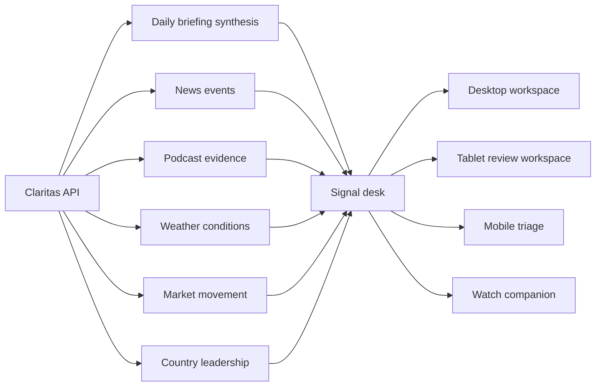

# Claritas UI Architecture and Cross-Device Design

This document is the source of truth for the Claritas product interface across web, iPhone, iPad, and Apple Watch. It describes the system implemented in `apps/web` and `apps/mobile/ios`, not a screenshot-specific layout.

## Objective

Claritas is an **analytics-first operational workspace**. The interface helps an operator answer four questions in order:

1. What changed?
2. Where did it change?
3. Why does it matter?
4. What needs attention?

The system is dense where comparison benefits from density and quiet where reading, configuration, or account management benefits from focus. It deliberately avoids using an equally weighted card grid for every job.

## Product and Data Model

The clients share one API and one selection model. A selected country or symbol should carry into relevant views until the user clears it.



Each domain has a distinct analytical responsibility:

| Domain | Primary question | Primary representation |
| --- | --- | --- |
| Daily briefing | What is the cross-domain situation? | Compact synthesis with key takeaways and freshness |
| News | What events are occurring and how significant is coverage? | Dense story stream, timeline, source mix, country coverage |
| Podcast intelligence | What claims, risks, and evidence support the signal? | Episode evidence, extracted signals, timestamps |
| Weather | Which conditions exceed operating thresholds and where? | Threshold queue, observation feed, map, distribution charts |
| Markets | Which instruments moved and what context may explain it? | Watchlist, symbol drilldown, session range, movers, benchmark regime |
| Leadership | Who provides the current country/government context? | Leadership map layer and country detail |

Maps and graphs are not decoration. Bubble maps answer spatial distribution questions. Graphs answer change, comparison, mix, correlation, and ranking questions. A visual is omitted when the available data cannot support a useful analytical statement.

## Information Architecture and Page Archetypes

```text
Claritas
├── Analyze
│   ├── Dashboard / signal desk
│   ├── News
│   ├── Podcasts
│   ├── Weather
│   └── Markets
├── Operate
│   └── Admin
└── Account and reference
    ├── Profile
    └── Policies
```

Claritas uses four page archetypes:

### Analytics workspace

Dashboard, News, Podcasts, Weather, and Markets use a compact page header, a control bar, a KPI strip, one dominant analytical surface, and explicitly secondary context. Desktop may show a comparison rail beside the hero surface. Tablet shows one or two major panels at a time. Mobile prioritizes triage and drill-in.

### Control room

Admin separates service health, manual triggers, automation, recent runs, user access, and raw logs. Status and run history come before mutation-heavy configuration. Raw JSON and logs are secondary diagnostic material.

### Settings

Profile uses section navigation and grouped settings rows. It does not inherit dashboard metrics or chart treatments. Identity and session trust are visually distinct from editable preferences.

### Document

Policies uses a table of contents, numbered sections, a constrained reading width, and reference notes. It does not use a policy-card grid.

Watch is a fifth, companion-only archetype: compact signal cards with freshness, threshold counts, a headline, a top mover, affected weather scope, and phone handoff.

## Shared App Shell and Navigation

### Web

- A persistent left navigation groups analysis, operations, and account destinations.
- A sticky top bar always shows page title, scope summary, live/freshness state, search, notifications, theme, and account state.
- The active page owns filtering and comparison controls.
- At mobile width, global navigation becomes a drawer plus a five-item monitoring bar: Dashboard, News, Weather, Markets, and Profile.
- Search is global and keyboard accessible with `Command/Ctrl+K` and `/`.

### iPhone

- `TabView` and `NavigationStack` preserve platform-native navigation.
- The dashboard is triage-first. The map is an on-demand disclosure, not the first full-height surface.
- Full data-domain workspaces remain available as drill-ins.
- Profile uses native settings controls and Policies uses a reading layout.

### iPad

- `NavigationSplitView` groups Workspace, Signals, Operations, and Account.
- The overview uses a deliberate two-column review layout: a dominant briefing or stream and a narrower focus/context column.
- Touch targets remain at least 44 points. Controls use native menus, segmented controls, and toolbars.

### Apple Watch

- The first page is a signal glance, not a briefing editor or mini-dashboard.
- Secondary pages are Daily Briefing, headline alerts, movers/breaches, and affected weather scope.
- Podcast evidence, leadership exploration, maps, charts, admin, profile editing, and policy reading are intentionally unavailable.
- “Open on iPhone” sends a destination through `WatchConnectivity`; the iPhone opens the matching workspace.

## Visual System and Tokens

Semantic tokens are the contract. Components must not infer meaning from a raw hue.

### Color roles

| Token | Dark value | Meaning |
| --- | --- | --- |
| `shell.bg` | `#081119` | Lowest workspace plane |
| `shell.bgElevated` | `#0C1822` | Control bars, rails, grouped settings |
| `shell.sidebar` | `#071018` | Navigation chrome |
| `shell.surface` | `#11222E` at 90% | Standard panel |
| `shell.surfaceStrong` | `#152A38` at 96% | Hero and selected workspace |
| `shell.ink` | `#F2EEE6` | Primary text and key values |
| `shell.muted` | `#A9B5BA` | Metadata and supporting copy |
| `shell.accent` | `#EDA36A` | Primary action and attention |
| `shell.accentSecondary` | `#77A8BA` | Selection, comparison, contextual data |
| `signal.positive` | semantic blue/teal | Healthy or positive state |
| `signal.negative` | semantic red | Negative movement or failure |
| `signal.warning` | semantic bronze | Threshold attention |

Light mode preserves the same roles. It is supported, but the default unconfigured web experience uses the dark high-trust base.

### Spacing and shape

- Spacing steps: 4, 8, 12, 16, 20, and 24 px.
- Control radius: 8–10 px.
- Panel radius: 12–14 px.
- Overlay radius: 16 px.
- Borders are separators, not decoration. Repeated nested outlines are avoided.
- Standard panels use no large shadow. Overlays may use a strong elevation shadow.

### Typography

- Body/UI: Work Sans on web and the system font on Apple platforms.
- Large numerical values use tabular, lining numerals.
- Display serif is limited to brand/auth contexts; it is not the default analytical heading.
- Section titles use sentence case.
- All-caps labels are reserved for very small metadata and are not used as the primary hierarchy.
- Reading content targets roughly 65–74 characters per line.

## Component Taxonomy

| Component | Contract |
| --- | --- |
| Page header | Title, scope summary, live/freshness state, top-level actions |
| Control bar | Grouped filters, explicit time/scope, sort, reset, compare/export where relevant |
| KPI strip | Value, context, optional delta/trend; separators instead of four floating cards |
| Primary chart | Largest analytical surface, labeled axes/legend, range/compare tools, useful empty state |
| Map | GeoJSON country layer plus scaled bubble overlay; intensity, rank, hover, polygon selection, legend, and readable country labels turn spatial data into an analytical control rather than a decorative globe |
| Country profile | Selection-driven cross-domain panel combining news concentration, weather and freshness, current leadership, linked markets, and routes to detailed workspaces |
| Context band | Podcast evidence and current leadership coverage; exposes the strongest available signal and routes directly to evidence or the leadership map layer |
| Table/feed | Compact rows with aligned metadata, selected state, dense scanning, expandable/drill-in detail |
| Insights rail | Exceptions, anomalies, AI/briefing cues, and action destination |
| Form section | Related controls grouped under one operational intent with clear feedback |
| Document section | Number, heading, readable text rhythm, note treatment, stable anchor |
| Compact watch card | One signal, freshness/context, and at most one simple action |

Shared web implementations live primarily in `apps/web/src/index.css` and `apps/web/src/App.tsx`. Shared native tokens and surface behavior live in `BrandComponents.swift` and `WatchBrand.swift`.

## Interaction Model

### Filtering and scope

- Filters are grouped at the top of each analytics workspace.
- The current region, time window, selected country, comparison country, and symbol remain visible in the header/control or selection bar.
- Reset clears page-specific selection without silently changing unrelated saved preferences.
- Mobile control bars are compact and scrollable; advanced simultaneous controls are reduced.

### Compare mode

- Compare is available only where two visible datasets can be interpreted together.
- Selected and comparison values use stable semantic colors across map, chart, legend, and tooltip.
- Compare tools remain full-workspace features; watch omits them.

### Drilldown and selection

- Selecting a country updates news, weather, market context, map state, and country leadership where data exists.
- Country polygons and bubble markers share the same selection model. Hover reveals mapped value and rank; selection opens the country profile and adds the country series to the primary trend.
- Selecting a dashboard headline expands only that row, reveals imagery and publisher context, and links its country to the map, profile, and trend. Unselected headlines remain compact monitoring rows.
- Selecting a symbol opens the market symbol workspace with price movement, session range, weather/geography context, related stories, and peer instruments.
- A watch handoff opens the corresponding iPhone destination.

### Sticky behavior

- The global web header is sticky.
- Desktop and tablet analytical control bars are sticky beneath it.
- Settings section navigation and document table of contents are sticky only when enough viewport width exists.
- Mobile does not stack multiple sticky bars; it uses a fixed primary monitoring bar and in-flow filter controls.

### Density

- Desktop rows target high information throughput.
- Tablet shows at most two major panels per stage and preserves 44-point touch targets.
- Mobile tables become analytical rows; images are omitted when they do not add interpretation.
- Watch limits lists to roughly six urgent/relevant items.

## Breakpoints and Adaptation Rules

Web breakpoints are device-role boundaries, not just CSS conveniences.

| Class | Width | Workspace level | Adaptation |
| --- | --- | --- | --- |
| Desktop | `>= 1280px` | Full workspace | Persistent sidebar; overview briefing; map + evidence/leadership context; chart + insights rail; full compare/export |
| Tablet web / iPad-like | `768–1279px` | Reduced workspace | One major stage at a time; briefing then map/context; full-width trend and insights; large touch controls; simplified simultaneous density |
| Mobile web / iPhone-like | `< 768px` | Triage workspace | KPI subset; compact briefing; podcast/leadership context; reduced-control map preview; anomaly queue and live feed; bottom monitoring nav |
| Narrow phone | `320–389px` | Triage workspace | Same content priority with shorter labels, horizontal filter/TOC scrolling, no wide charts/tables |
| Apple Watch | watchOS layout system | Companion only | Signal glance, freshness, briefing excerpt, top mover, affected weather, headline alerts, phone handoff |

### Content priority by device

| Content | Desktop | Tablet | Mobile | Watch |
| --- | --- | --- | --- | --- |
| KPI summary | Full strip | 2-column strip | Top subset | One threshold count |
| Daily briefing | Prominent overview synthesis | Primary review panel | Two-line/two-takeaway compact synthesis | Short excerpt |
| Primary chart | Full, interactive | Full-width, touch-friendly | One useful chart without brush | Omitted |
| Map bubbles | First-row spatial overview | Full-width staged panel | Compact reduced-control preview on mobile web; on-demand drill-in in the native app | Omitted |
| Podcast and leadership context | Two-lane evidence/context band beside the map | Full-width staged band | Compact actionable rows before the map preview | Omitted |
| Dense feed/table | Side-by-side | Full-width stage | Compact rows | Top six only |
| Compare/export | Full | Reduced | Drill-in only | Omitted |
| Admin mutation | Full | Full touch forms | Status/refresh only | Omitted |
| Settings | Full section layout | Two-pane/native | Native settings flow | Omitted |
| Policies | TOC + reading column | Reading column | Horizontal section nav | Omitted |

## Page Rules

### Dashboard

- KPI strip establishes cross-domain posture.
- Daily briefing is the first synthesis surface because it answers what changed and why it matters across domains.
- The world map is the first visual analysis surface and remains visible without requiring a drilldown on web. It uses country geometry for hit areas and intensity, with log-scaled news bubbles to preserve differences without letting outliers obscure smaller countries.
- The panel beside the desktop map shows podcast/leadership context until a country is selected, then becomes a cross-domain country profile. Clearing selection restores the global context band.
- The primary trend and attention queue follow the overview stage, preserving analytical depth without displacing synthesis and spatial orientation.
- The live feed is a full-width monitoring surface after the overview and trend stages. News defaults to dense rows with time, geography, headline, and source; image and long summary appear only for the selected row.

### News

- Story stream is the primary task.
- Rows expose source, country, time, summary, and selection state.
- The map is a spatial coverage tool and is secondary to the stream.
- Timeline, source mix, and country/market context support the stream.

### Weather

- Thresholds are explicit: heat `>= 35°C`, freeze `<= 0°C`, humidity `>= 85%`, and wind `>= 15 m/s`.
- The alert summary identifies affected locations.
- Map and observation feed show distribution and current state.
- Scatter, condition mix, and temperature ranking remain supporting analytics.

### Markets

- Watchlist rows are compact and selectable.
- The selected symbol workspace is larger than the list on desktop.
- Symbol detail includes last price, session move, range position, primary market, industry/market cap where available, related weather, stories, and peers.
- Exchange status and earnings remain compact operational panels.

### Admin

- Service/run scope and refresh come first.
- Manual trigger, automation, metrics, history, and logs are distinct sections.
- Raw payloads/logs use a deliberate diagnostic treatment.
- Mobile is status-only with refresh; mutation-heavy controls require tablet or desktop.

### Profile and Policies

- Profile uses settings hierarchy, section navigation, native controls, and clear identity/security state.
- Policies uses stable anchors, a table of contents, numbered document sections, reading width, and optional reference material.

## Accessibility and Responsive Principles

- Text and state are never differentiated by color alone.
- Interactive controls have visible hover, focus, selected, disabled, loading, and error states.
- Web controls use `:focus-visible`; native controls retain system focus and accessibility behavior.
- Touch targets are at least 44 by 44 points on touch-oriented surfaces.
- Charts provide labels, legends, and tooltips; key conclusions also appear in text/KPIs.
- Reduced-motion preferences disable entrance animation and nonessential transitions.
- Safe-area insets are respected on web/PWA, iPhone, iPad, and watch.
- Content remains usable from 320 px; horizontal scrolling is limited to intentional control, document-nav, and table regions.

## State Handling

| State | Rule |
| --- | --- |
| Loading | Keep the panel title/scope stable; show progress in the action or content region |
| Empty | Explain what is empty, preserve filters, and provide the next valid action |
| Error | State the affected source/action; do not imply unrelated domains failed |
| Stale | Keep cached data visible, label freshness, and offer refresh/handoff |
| Live | Show a semantic live indicator plus a human-readable updated time |
| Success | Confirm mutation near the affected control without replacing the whole workspace |

Watch explicitly distinguishes ready, refreshing, phone-required, and cached/failed state.

## Why Layouts Differ

Analytics pages benefit from simultaneous comparison and therefore use dominant charts/maps plus supporting rails and feeds. Settings pages benefit from predictable grouping and short edit paths. Policy pages benefit from reading rhythm and stable references. Admin pages benefit from operational safeguards and separation between observation and mutation. Watch benefits from urgency, freshness, and handoff; reproducing maps, charts, forms, or document pages would reduce usefulness.

Shared tokens and component contracts create one product identity. Shared geometry is not required when the device role or task is different.

## Implementation Map

| Concern | Web | iPhone/iPad | Watch |
| --- | --- | --- | --- |
| Shell/navigation | `apps/web/src/App.tsx`, `index.css` | `RootView.swift` | `WatchRootView.swift` |
| Tokens/surfaces | `index.css` | `BrandComponents.swift` | `WatchBrand.swift` |
| Dashboard | `App.tsx` | `DashboardView.swift`, `PadOverviewView.swift` | `WatchSignalGlanceView`, `WatchBriefingView` |
| Maps | `WorldMapBubbles.tsx` | `InteractiveCountryBubbleMap` | Intentionally unavailable |
| Admin | `AdminIngestionPanel.tsx`, `AdminUserManagementPanel.tsx` | `AdminWorkspaceView` | Intentionally unavailable |
| Settings/documents | `App.tsx` | `ProfileView.swift`, `PoliciesWorkspaceView` | Phone handoff only |
| Handoff | N/A | `WatchSyncCoordinator.swift` | `WatchConnectivityClient.swift` |

## Migration Note

The previous UI relied on repeated rounded, bordered, glass-like cards with similar visual weight. Narrative briefing content often preceded stronger analytical surfaces, feeds used oversized rows, filters were spread across panels, and settings/documents inherited dashboard styling.

The current system:

- flattens standard panels and reduces borders, shadows, and radius;
- moves KPI, briefing synthesis, spatial orientation, and evidence context ahead of detailed trend/feed analysis;
- consolidates controls into consistent bars;
- converts news, weather, market, and run history content into denser rows;
- gives market symbols a real contextual drilldown;
- gives weather explicit thresholds;
- preserves the daily briefing, map bubbles, and useful charts with clearer roles, while promoting podcast evidence and leadership context into the dashboard overview;
- gives Admin, Profile, and Policies separate archetypes;
- treats tablet as a staged two-column review workspace;
- treats mobile as triage and drill-in;
- treats watch as companion-only with phone handoff.

Related decisions are recorded in:

- [ADR-0001: Analytics-first UI shell and hierarchy](../ADRs/0001-analytics-first-ui-shell.md)
- [ADR-0002: Multi-device adaptive strategy](../ADRs/0002-multi-device-adaptive-strategy.md)
- [ADR-0003: Semantic tokens and component taxonomy](../ADRs/0003-semantic-ui-system.md)
