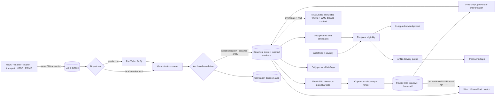

# Unified Signal Desk, event correlation and Earth Observation

Claritas treats a material development as one evolving evidence graph. News and domain pages remain useful source lenses, but the Signal Desk is the investigation surface: a story, official observation, market/transport signal and defensible satellite evidence can all resolve to the same canonical event and time-ordered evidence thread.

The dotted GIBS edge is intentional: GIBS is on-demand browse context, not a persisted Claritas observation or an input to vision enrichment.

## Correlation boundary

- Source ingestion commits independently from correlation. Every domain envelope has a stable ID, type, aggregate ID, occurrence time and bounded payload.
- Consumer claims make at-least-once delivery idempotent. Reprocessing the same source record retains its canonical event assignment and does not duplicate evidence.
- Candidate search is bounded by active status, compatible event family, event-specific time window and at least one database prefilter: exact non-country location, spatial distance, country or entity.
- The final weighted decision considers time, distance, exact location, country, shared entities, event family and source reliability. Acceptance additionally requires a specific anchor: exact location, sufficiently close coordinates or meaningful entity overlap. Country and time alone can never merge broad generic news.
- Each create/attach decision stores candidate, selected event, score, threshold, factors, methodology and rationale in the correlation audit. Evidence retains its own correlation score/factors.
- Stronger canonical evidence can improve the event title and summary. A later weak story cannot overwrite a better existing headline merely because it is newer.
- Event relevance and domain/source counts are recomputed from the accumulated evidence. Alert and EO eligibility use this post-aggregation event state.

This boundary is the “red thread” between News and EO: a navigable news item becomes labelled `reported` evidence on an event; that event can collect official/physical corroboration and request EO when its type, score and exact geography support it.

## Earth Observation boundary

- Automatic EO discovery supports wildfire, flood, severe storm, agricultural stress, transport/aviation disruption, earthquake and security event families. It uses a lower governed threshold for observable event types so a sufficiently specific news-led event can start discovery.
- Automatic jobs require finite exact signal/event coordinates; a canonical location is optional. Exact event geography takes precedence over a canonical location bounding box/point. Missing, partial or country-only geography fails; it is never coerced to `(0,0)`. An explicit Admin location-only trigger remains available for deliberate operator inspection.
- Initial automatic discovery identity includes event, optional location and UTC discovery day. At most two follow-up discoveries are scheduled 24 hours apart with distinct revisit keys, preserving an auditable observation window without same-window duplicates.
- The event family selects the requested products: true colour/burn index for wildfire, SAR/NDWI for flood, SAR/true colour for severe storm and transport disruption, NDVI for agricultural stress, true colour for aviation disruption, and SAR/true colour for earthquake and security incidents. Discovery balances compatible Sentinel-1/Sentinel-2 scenes and renders every compatible requested product rather than silently substituting a generic product.
- Copernicus discovery is bounded by date window, AOI, cloud/sensor ranking and selected-scene count. Render admission checks current UTC-day and UTC-month usage plus a four-unit estimate before the call; the provider's returned processing units are recorded afterward.
- Rendered previews and thumbnails are stored in a private bucket and exposed only through authenticated UUID-addressed routes. Clients never receive provider credentials or GCS object names.
- EO jobs are leased, retry-bounded and visible as queued/running/success/failed/dead-letter/budget-deferred state. Vision failure is secondary and cannot turn an already-available physical observation into a failed one.

`EO_MAX_DAILY_PROCESSING_UNITS=100` and `EO_MAX_MONTHLY_PROCESSING_UNITS=3000` are local admission ceilings. Both check recorded usage plus `EO_ESTIMATED_PROCESSING_UNITS_PER_RENDER=4`; exhaustion defers a job to the next UTC day/month without consuming an attempt. This preflight estimate is not an atomic provider-unit reservation. Actual usage is known only after the call, so provider-side quota remains the hard protection against a request consuming more than estimated. A non-positive ceiling means unlimited and must not be used as a pause control.

## GIBS boundary

The authenticated event GIBS route derives the observation date from the event start time and derives its AOI with the same exact-geography-first resolver used by Copernicus. Callers cannot supply a layer ID or arbitrary URL. The response contains four reviewed EPSG:4326 layer records—MODIS Terra/Aqua and VIIRS NOAA-20 true colour plus MODIS aerosol optical depth—with a WMTS template, a fixed-parameter WMS 1.3 `GetMap` preview URL, date, bounding box, attribution, acknowledgement and reuse notice. Preview dimensions are aspect-bounded to 256–768 pixels.

The Claritas API does not fetch, validate availability, cache, proxy or persist these images. The web Signal Desk loads the first true-colour preview directly from NASA; Apple clients currently render persisted Copernicus observations and do not consume the GIBS route. GIBS context therefore does not create scenes, observations, assets or vision jobs. It is contextual browse imagery, not automatic proof of physical change or causation. A future stored GIBS product would require a separate provider, cost, licence and lifecycle decision.

## Vision interpretation boundary

Vision is optional `model_interpretation` evidence derived from one available Copernicus preview. The image is size-checked, resized, and submitted with bounded event/sensor context and a strict JSON schema. The prompt prohibits inferred cause, intent, casualties, ownership or pixel-unsupported damage and requires acquisition/sensor limitations.

The default route is `openrouter/free`. Claritas records the actual model and rejects a response reporting non-zero cost. An exact override must be catalogued as image-input, structured-output capable and exactly zero-priced, and the response must come from that exact model. Results preserve prompt version and model provenance, are confidence-capped at 0.75, and never replace the underlying observation. Free-route availability is best effort; no paid fallback exists.

## Alert and APNs boundary

- High/critical events above the alert threshold create deduplicated alert candidates; watchlists materialize user eligibility and in-app acknowledgement state.
- APNs delivery is a separate bounded worker. It materializes a bounded batch only for active, entitled accounts/devices and deliverable, unacknowledged candidates from the previous 24 hours, uses leased/skip-locked claims and records accepted, retry, dead-letter, invalid-token and suppressed outcomes.
- The server requires a valid P-256 signing key plus Apple's 10-character uppercase alphanumeric team ID and key ID. Incomplete or malformed credentials make the active feature `not_configured`; the worker sends nothing.
- Each device records a stable installation UUID, development or production environment and an app bundle ID that must match the configured topic. Token rotation retires the previous token for that installation. Per-user active and retained-row caps bound fan-out and storage.
- Active device tokens cannot move between accounts. Session-authenticated unregister remains available after paid access lapses and an unregister-all fallback exists. Inactive accounts are deactivated; lapsed accounts and muted, failed or expired candidates are suppressed. Immediately before sending, the worker rechecks access, candidate state, device ownership/version, topic, alert age, eligibility and acknowledgement.
- Readiness distinguishes `not_configured`, `configured_unverified`, provider-verified `ready` and `degraded` for the current credential fingerprint. Omitted deployment secrets preserve any existing Kubernetes secret and never imply deactivation.
- An APNs HTTP 200 is stored as `accepted`. It means Apple accepted the provider request, not that the alert was displayed, seen or acknowledged. User acknowledgement remains separate.

## Client contract

The event list is prioritized by relevance and activity. Detail responses expose hydrated source titles, summaries and URLs where available; evidence grouped by domain; locations and related events; EO observations/assets; and epistemic notices. News can deep-link to its canonical event, while the event timeline links back to the original story. Event-specific imagery appears inside the investigation; on web this can include direct NASA GIBS browse context as well as persisted observations. The separate Imagery library is a provenance catalogue, not a parallel intelligence workflow.

The native push payload carries the exact `event_id`, event type, severity and optional country and opens the Signal Desk selection. The Watch surface remains concise and hands the exact event to iPhone when appropriate.

## Data lifecycle and operator status

Outbox, correlation decisions, evidence and job/delivery state remain auditable. EO object lifecycle defaults to 60 days and can be changed with `EO_ASSET_RETENTION_DAYS`; object policy and database reconciliation must remain aligned. Raw transport retention remains defined by the transport architecture. Active event records and evidence remain in Cloud SQL until an explicit product retention policy supersedes this foundation.

`GET /api/admin/intelligence/status` is the operational source of truth for backbone state, rapid sources, EO provider readiness/usage/queue/assets and APNs readiness/devices/delivery states. A flag value alone is never a readiness assertion.
