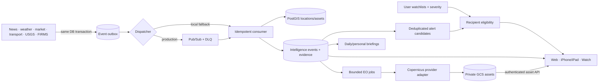

# Event-driven intelligence and Earth Observation

Claritas now treats a material development as an evidence graph rather than a collection of adjacent feed cards.

## Runtime boundaries

- Source ingestion commits independently from correlation.
- Every domain envelope has a stable ID, type, aggregate ID, occurrence time and bounded payload.
- Consumer claims make at-least-once delivery idempotent. Failures retry and then dead-letter.
- Correlation requires geography, a canonical location or a shared entity in addition to time/type compatibility.
- Evidence is labelled `reported`, `observed`, `derived`, `model_interpretation`, `assessment`, `corroborates`, `contradicts` or `context`.
- EO jobs are relevance-gated, deduplicated, leased, retry-bounded and budget checked.
- Alert candidates are matched to enabled user watchlists in a restartable recipient table. In-app acknowledgement is implemented; no row is marked externally delivered without a real channel.
- Optional provider clients never run unless their feature flag is enabled; credentialed providers also report `not_configured` rather than failing application startup.

## Client contract

The event list is prioritized by relevance and activity. Detail responses include evidence grouped by domain, locations, related events, EO observations and an epistemic notice. Watchlist matches appear as acknowledgeable in-app alerts. Imagery endpoints expose Claritas asset UUIDs, not GCS objects or provider tokens. The Watch surface contains only concise high-impact events and opens the exact event on iPhone.

## Data lifecycle

Outbox and job state remain auditable. EO object lifecycle defaults to 60 days and can be reduced with `EO_ASSET_RETENTION_DAYS`. Raw transport retention remains defined by the transport architecture. Active event records and evidence remain in Cloud SQL until an explicit product retention policy supersedes this foundation.
