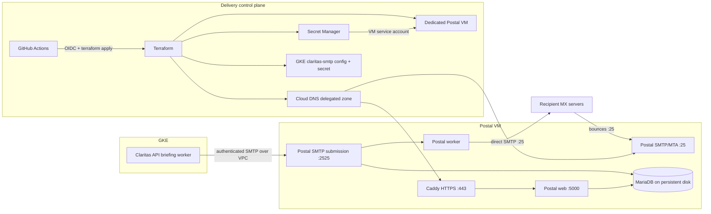

# Postal email delivery architecture

## Decision

Claritas runs [Postal](https://docs.postalserver.io/) on a dedicated Compute Engine VM rather than
inside GKE. Postal's own prerequisites recommend a dedicated host with at least 2 CPU cores, 4 GB
RAM, and 25 GB storage. A VM also provides the stable public IP and configurable PTR record that a
mail-transfer agent needs; Google Cloud does not support configurable PTR records on load-balancer
or Cloud NAT addresses.

The deployment is disabled by default (`postal_enabled = false`). Enabling it creates only resources
defined in `infra/gcp/terraform`; GitHub Actions is the deployment and readiness path.

## Infrastructure and trust boundaries

- `claritas-postal` is an Ubuntu 24.04 LTS VM sized as `e2-standard-2` by default.
- A 50 GB balanced persistent disk contains MariaDB and Caddy state. A daily snapshot policy keeps
  automatic snapshots for 14 days and retains them if the source disk is removed.
- Postal `3.3.6`, MariaDB `11.4.12`, and Caddy `2.11.4` are version-pinned containers. Postal runs
  separate web, public SMTP, private submission, and worker processes as required by its container
  architecture.
- The application submits to the VM private IP on port 2525. Its firewall rule accepts only RFC1918
  source ranges and Postal still requires an SMTP credential.
- Public port 25 is an MTA endpoint for deliveries and bounces, not an unauthenticated application
  relay. HTTPS is public by default; SSH is limited to Google IAP.
- MariaDB listens only on loopback. Postal secrets are generated by Terraform, held in Secret
  Manager, and read by the VM's dedicated service account. No static GCP key is issued.
- OS Login, Shielded VM secure boot, vTPM, integrity monitoring, Docker log rotation, local health
  endpoints, post-apply health checks, and an external-port-25 readiness check are enabled. A
  scheduled GitHub Actions workflow repeats service, DNS, HTTPS, PTR, and egress checks every six
  hours once Postal is enabled.

## DNS isolation

The current Microsoft-hosted mail records for `claritas.info` are not modified. Postal owns the
delegated subdomain `briefings.claritas.info`. Terraform creates its Cloud DNS zone and manages:

- A records for `postal`, `smtp`, `rp`, and `track`;
- MX records for the sending domain, return path, and route domain;
- SPF records for the server, sending domain, and return path;
- deterministic return-path and sending-domain DKIM records;
- DMARC in monitoring mode (`p=none`) initially.

The only parent-provider change is an NS delegation for `briefings.claritas.info` to the four Cloud
DNS nameservers emitted by the Terraform output. The public IP's PTR must be
`smtp.briefings.claritas.info`; enabling that Terraform field requires prior domain-ownership
verification with Google.

## Code-managed Postal configuration

The VM startup template writes `postal.yml`, Caddy configuration, Docker Compose, health scripts,
and a systemd unit. After initializing Postal's schema, a version-pinned Rails bootstrap creates or
reconciles:

- the Postal administrator;
- the `Claritas` organization;
- the live `Claritas Briefings` mail server;
- the verified sending domain and deterministic DKIM key;
- the SMTP credential used by the Claritas API.

This uses Postal's internal model layer because Postal 3.3.6 has no supported administration API
for these resources. It is idempotent but must be regression-tested when the pinned Postal version
is upgraded. Day-to-day infrastructure and configuration changes remain Terraform/GitHub Actions
changes; the Postal UI is for operational inspection.

## Delivery activation gates

Provisioning and actual user delivery are separate. `POSTAL_ENABLED=true` provisions Postal while
`POSTAL_EMAIL_DELIVERY_ENABLED=false` keeps the briefing worker disabled. Enable delivery only when:

1. the delegated zone resolves publicly;
2. the HTTPS UI and all Postal services pass the workflow health check;
3. the external TCP/25 check passes from the VM;
4. forward DNS and PTR match the SMTP hostname;
5. SPF, DKIM, and DMARC checks pass;
6. test messages deliver successfully and the new IP is not on major blocklists.

Google Cloud commonly blocks external destination TCP port 25. Terraform cannot change that
platform control. If the project is not eligible for direct port-25 egress, direct Postal delivery
cannot be activated in this design; the fallback is an upstream SMTP relay on port 587/465.

## Deployment sequence and repository configuration

The Terraform workflow reads Postal settings from GitHub Actions repository variables. Use this
two-phase sequence so infrastructure can be checked before user email is enabled.

| Repository variable | Initial value | Purpose |
| --- | --- | --- |
| `POSTAL_ENABLED` | `true` | Provisions Postal and creates the disabled GKE SMTP configuration. |
| `POSTAL_DOMAIN` | `briefings.claritas.info` | Dedicated subdomain delegated to Cloud DNS. |
| `POSTAL_ADMIN_EMAIL` | operator's real address | Username for the bootstrapped Postal administrator. |
| `POSTAL_ENABLE_PUBLIC_PTR` | `false` initially | Set to `true` after Google verifies domain ownership. |
| `POSTAL_EMAIL_DELIVERY_ENABLED` | `false` initially | Set to `true` only after all activation gates pass. |
| `POSTAL_ENFORCE_PORT25_EGRESS` | `true` | Fails the workflow readiness stage when direct SMTP egress is unavailable. |
| `POSTAL_SENDER_ADDRESS` | `daily@briefings.claritas.info` | Briefing From address. |
| `POSTAL_REPLY_TO` | empty | Optional monitored reply mailbox. |

`POSTAL_SMTP_CREDENTIAL` is an optional GitHub Actions secret for deliberately supplying a fixed
credential. Leave it unset to use Terraform's generated credential.

1. Set the initial variables above and run **Terraform Infrastructure Deployment** manually.
2. Copy `postal_dns_delegation.nameservers` from the workflow summary into an NS record for
   `briefings.claritas.info` at the parent DNS provider.
3. Verify domain ownership in Google Search Console, set `POSTAL_ENABLE_PUBLIC_PTR=true`, and rerun
   the workflow. Check that forward and reverse DNS both resolve to the same hostname/IP.
4. Confirm the workflow's external TCP/25 check passes. If it fails, resolve Google project
   eligibility or choose the upstream-relay fallback before continuing.
5. Retrieve the generated admin password with the command in the workflow summary and inspect
   Postal at `https://postal.briefings.claritas.info`.
6. Send low-volume deliverability tests. When DNS alignment and reputation checks pass, set
   `POSTAL_EMAIL_DELIVERY_ENABLED=true` and rerun the workflow.

The GitHub OIDC Terraform service account must be able to enable project services and manage
Compute Engine, Cloud DNS, Secret Manager, service accounts/project IAM, IAP access, GKE resources,
and the existing GCS Terraform state. These bootstrap permissions must exist before Terraform can
grant the narrower Postal runtime permissions.

## Lifecycle

- Upgrade container versions only through reviewed Terraform variable defaults or repository
  variables. The bootstrap runs Postal's idempotent database update path before services start.
- Restore by creating a replacement data disk from an automatic snapshot and attaching it through
  Terraform. Preserve the static IP and all Secret Manager versions.
- Monitor queue depth, bounce/complaint rates, disk capacity, IP reputation, and the Postal worker
  and SMTP health endpoints before raising volume.
- Move DMARC from `none` to `quarantine`, then `reject`, only after alignment reports are clean.
