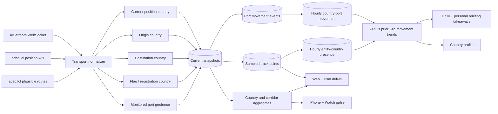

# Transport intelligence

Claritas combines maritime AIS messages and live ADS-B observations into one country-linked movement model. The implementation keeps provider credentials and high-volume ingestion server-side, samples trails before persistence, and gives each client the level of detail appropriate to the device.

## Data flow

Only one API replica holds the PostgreSQL advisory lock for scheduled transport ingestion. This prevents duplicate global WebSocket subscriptions and polling loops while keeping the API itself horizontally scalable. HTTP refresh requests only bypass the short-lived overview cache; they never launch ingestion work from a request-serving replica.

## Sources and configuration

### AISstream

- Runtime environment variable and GitHub Actions repository secret: `AISSTREAM_API_KEY`.
- Kubernetes secret: `claritas-aisstream`, key `AISSTREAM_API_KEY`.
- `AISSTREAM_ENABLED` is the operational safety switch and defaults to `true`.
- Default subscription covers the global bounding box and requests position, Class B position, long-range position, ship static, and static data reports.
- `AISSTREAM_BOUNDING_BOXES` can replace global coverage with a JSON array of provider-format bounding boxes.
- `AISSTREAM_SAMPLE_SECONDS` controls current-position sampling and defaults to 300 seconds.
- MMSI Maritime Identification Digits link a vessel to its flag country. Position-in-country, monitored-port geofences, the first observed voyage country and position, and recognizable AIS destination/UN LOCODE values add current, origin, and destination relationships. When a declared destination resolves to a monitored port, its coordinates are retained so the individual vessel map can draw a route from the first observed position to that port.

### adsb.lol

- No API key is required.
- `ADSB_LOL_POLL_ENABLED` enables scheduled collection and defaults to `true`.
- `ADSB_LOL_POLL_SECONDS` defaults to 300 seconds.
- `ADSB_LOL_MAX_ROUTE_LOOKUPS` limits plausible route candidates per cycle and defaults to 2,000. Candidates are sampled proportionally across currently observed countries, then resolved against adsb.lol's CDN-backed standing-route records so early polling areas cannot consume the global budget. Successful and unknown callsigns are cached for 20 minutes; repeated provider failures open a short circuit breaker instead of delaying the whole refresh.
- `ADSB_LOL_POLL_POINTS` can override the built-in global hub grid with JSON objects containing `label`, `lat`, `lon`, and a radius of at most 250 nautical miles.
- `ADSB_LOL_USER_AGENT` should identify the deployment and a monitored contact.

adsb.lol describes its public API as free and keyless today, distributes its data under ODbL 1.0, and asks production users to contact the project so service changes do not unexpectedly break an application. Production ownership should therefore include provider coordination and monitoring.

## Country linkage

Each current snapshot may carry multiple explicit country roles:

| Role | Maritime basis | Aviation basis |
| --- | --- | --- |
| Current | Monitored-port geofence, otherwise the Natural Earth polygon containing the AIS position | Natural Earth polygon containing the ADS-B position |
| Origin | First observed country before a declared destination | Origin airport returned with a plausible route |
| Destination | AIS destination interpreted as UN LOCODE, port, or country | Destination airport returned with a plausible route |
| Flag / registration | ITU-R M.585 MMSI MID | Registration identifier when available |

Country aggregates count unique vehicles per role. A single vehicle is counted once in a country's total even when it has several roles for that country. Maritime corridors fall back to flag-to-destination when a defensible origin has not yet been observed; route aggregates expose whether their origin is observed, a flag fallback, or mixed. The country-connection tooltip and corridor list label proxy evidence instead of presenting that link as an exact port-to-port voyage.

## Movement trends and takeaways

Claritas compares the latest 24 hours with the preceding 24 hours:

- A ship departure is recorded once when a current vessel snapshot leaves one of the monitored port geofences. An arrival is the inverse transition. These immutable transition events replace repeated window-function scans over raw tracks.
- Cargo-vessel flow counts departures from AIS ship categories `cargo` and `tanker`. It is a movement proxy only. AIS does not disclose cargo tonnage, vessel load, trade value, or complete port-authority movement totals.
- Flight activity counts unique aircraft with a current, origin, or destination country link in each window. Coverage depends on configured poll areas and upstream ADS-B reception.
- Percentage change is `(current - previous) / previous`. When the previous window is zero, the API labels non-zero activity as a new baseline instead of manufacturing a percentage.

The API returns both the underlying current/previous values and concise, qualified takeaways. Web and iPad show the full port and trend detail. When a country is selected, the web workspace derives country-linked live totals, resolved arrivals and departures, current-position count, strongest counterpart, network reach, and origin/destination coverage from the same scoped response. Selecting a resolved counterpart then narrows those aggregates to the two-way corridor: total active movements, each direction, mode mix, share of the country's resolved network, and observed versus flag-proxy origin evidence. iPhone and Watch show the takeaways without raw vehicle data. Country profiles use the country-scoped trend, while daily and personal briefings receive the same data and methodology notes as evidence for generation.

## API

- `GET /api/transport/overview?detail=aggregate` returns KPIs, country aggregates, corridor aggregates, 24-hour trend comparisons, qualified takeaways, monitored-port movement, hourly activity, freshness, and source coverage. iPhone, Watch, country profiles, and briefing generation use this response.
- `GET /api/transport/overview?detail=full` adds current flight and vessel records for web and iPad. Optional `mode`, `country`, and `entity_limit` filters apply consistently to aggregates and details. Country-scoped corridor results include only routes whose resolved origin or destination is that country, while the broader entity result retains explicit current/flag/registration linkage.
- `GET /api/transport/entities/:mode/:entityId` returns the current normalized record and up to 24 hours of sampled track points.

All endpoints use the same authenticated paid-access boundary as the other Claritas intelligence domains. The AISstream credential is never returned to a client. Equivalent overview requests are coalesced and cached for 60 seconds per API replica. Overview refreshes run at most two database reads concurrently, and maritime comparisons read the hourly movement aggregate instead of rescanning event history. Briefing generation treats transport as optional evidence: a transient transport read failure uses the last successful aggregate when available, or an explicit empty transport context, without blocking the other briefing sources or email delivery.

## Presentation contract

- Web and iPad show current vehicles on a 50m-detail base map, exact route curves when endpoint coordinates are available, and non-directional country-connection bands for every resolved corridor in a selected country scope. Blue bands identify flight connections and orange bands identify shipping connections; opposite-direction aggregates collapse into one band per mode, while the band width communicates active volume. Arrowheads are reserved for individual aircraft and vessel routes, so direction always refers to a live vehicle rather than an aggregate relationship. Country selection filters markers to explicitly linked vehicles, gives each one a visible linkage ring, summarizes the strongest counterpart, resolved direction totals, current-position count, network reach, and route quality, and replaces the empty detail rail with a selectable list that states whether every vehicle is inbound, outbound, currently present, or linked by flag/registration. A counterpart can be selected from the strongest-country aggregate, the corridor control, the country table, a corridor row, or a connected map node. The resulting two-country view reports the total and both directions, filters route aggregates and selectable vehicles to that pair, and keeps proxy-origin qualifications visible. Selecting a vehicle directly on the map or in the list focuses the map, keeps its marker size usable at deep zoom, refreshes its live position and sampled 24-hour trail, and exposes its flight number or MMSI and country chain. Country scope returns to a fitted view of all visible connection endpoints. Trend takeaways, monitored-port movement, a 24-hour activity chart, most-connected-country bars, corridor flows, and a dense identifier table remain available below the map.
- iPhone shows only KPIs, qualified trend takeaways, leading countries, and leading corridors. It does not receive raw vehicles or track points during normal app bootstrap.
- Watch shows only aggregate flight/vessel/country counts, a qualified takeaway, an aggregate country bubble map, and the leading corridor, with a handoff to the iPhone transport section.

Freshness windows are 20 minutes for aviation and two hours for maritime snapshots. Historical track points are sampled at five-minute resolution and retained for seven days. Current snapshots are retained for 30 days after their last observation; movement events and hourly aggregates are retained for 90 days. The advisory-lock owner prunes expired rows in bounded batches once an hour.

The operational defaults are documented in [Cloud SQL capacity and transport load](operations/cloud-sql-capacity.md).
