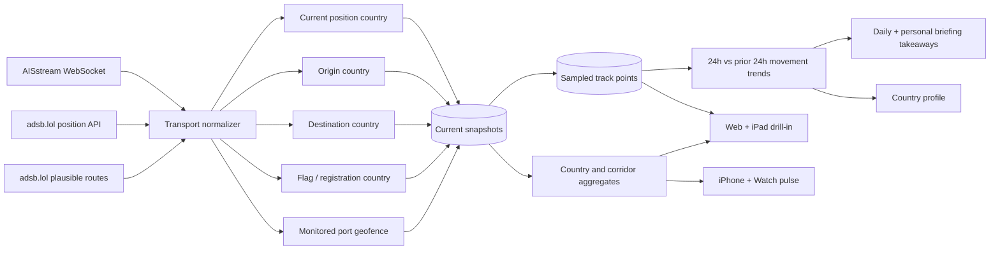

# Transport intelligence

Claritas combines maritime AIS messages and live ADS-B observations into one country-linked movement model. The implementation keeps provider credentials and high-volume ingestion server-side, samples trails before persistence, and gives each client the level of detail appropriate to the device.

## Data flow

Only one API replica holds the PostgreSQL advisory lock for scheduled transport ingestion. This prevents duplicate global WebSocket subscriptions and polling loops while keeping the API itself horizontally scalable.

## Sources and configuration

### AISstream

- Runtime environment variable and GitHub Actions repository secret: `AISSTREAM_API_KEY`.
- Kubernetes secret: `claritas-aisstream`, key `AISSTREAM_API_KEY`.
- Default subscription covers the global bounding box and requests position, Class B position, long-range position, ship static, and static data reports.
- `AISSTREAM_BOUNDING_BOXES` can replace global coverage with a JSON array of provider-format bounding boxes.
- `AISSTREAM_SAMPLE_SECONDS` controls current-position sampling and defaults to 60 seconds.
- MMSI Maritime Identification Digits link a vessel to its flag country. Position-in-country, monitored-port geofences, the first observed voyage country, and recognizable AIS destination/UN LOCODE values add current, origin, and destination relationships.

### adsb.lol

- No API key is required.
- `ADSB_LOL_POLL_ENABLED` enables scheduled collection and defaults to `true`.
- `ADSB_LOL_POLL_SECONDS` defaults to 120 seconds.
- `ADSB_LOL_MAX_ROUTE_LOOKUPS` limits plausible route lookups per cycle and defaults to 60.
- `ADSB_LOL_POLL_POINTS` can override the built-in global hub grid with JSON objects containing `label`, `lat`, `lon`, and a radius of at most 250 nautical miles.
- `ADSB_LOL_USER_AGENT` should identify the deployment and a monitored contact.

adsb.lol describes its public API as free and keyless today, distributes its data under ODbL 1.0, and asks production users to contact the project so service changes do not unexpectedly break an application. Production ownership should therefore include provider coordination and monitoring.

## Country linkage

Each current snapshot may carry multiple explicit country roles:

| Role | Maritime basis | Aviation basis |
| --- | --- | --- |
| Current | Monitored-port geofence, otherwise the Natural Earth polygon containing the AIS position | Natural Earth polygon containing the ADS-B position |
| Origin | First observed country before a declared destination | Origin airport returned with a plausible route |
| Destination | AIS destination interpreted as UN LOCODE, port, or country | Destination airport returned with a plausible route |
| Flag / registration | ITU-R M.585 MMSI MID | Registration identifier when available |

Country aggregates count unique vehicles per role. A single vehicle is counted once in a country's total even when it has several roles for that country. Maritime corridors fall back to flag-to-destination when a defensible origin has not yet been observed; the UI labels the source and confidence basis instead of presenting that link as an exact port-to-port voyage.

## Movement trends and takeaways

Claritas compares the latest 24 hours with the preceding 24 hours:

- A ship departure is observed when a sampled vessel track leaves one of the monitored port geofences. An arrival is the inverse transition.
- Cargo-vessel flow counts departures from AIS ship categories `cargo` and `tanker`. It is a movement proxy only. AIS does not disclose cargo tonnage, vessel load, trade value, or complete port-authority movement totals.
- Flight activity counts unique aircraft with a current, origin, or destination country link in each window. Coverage depends on configured poll areas and upstream ADS-B reception.
- Percentage change is `(current - previous) / previous`. When the previous window is zero, the API labels non-zero activity as a new baseline instead of manufacturing a percentage.

The API returns both the underlying current/previous values and concise, qualified takeaways. Web and iPad show the full port and trend detail. iPhone and Watch show the takeaways without raw vehicle data. Country profiles use the country-scoped trend, while daily and personal briefings receive the same data and methodology notes as evidence for generation.

## API

- `GET /api/transport/overview?detail=aggregate` returns KPIs, country aggregates, corridor aggregates, 24-hour trend comparisons, qualified takeaways, monitored-port movement, hourly activity, freshness, and source coverage. iPhone, Watch, country profiles, and briefing generation use this response.
- `GET /api/transport/overview?detail=full` adds current flight and vessel records for web and iPad. Optional `mode`, `country`, and `entity_limit` filters apply consistently to aggregates and details.
- `GET /api/transport/entities/:mode/:entityId` returns the current normalized record and up to 24 hours of sampled track points.

All endpoints use the same authenticated paid-access boundary as the other Claritas intelligence domains. The AISstream credential is never returned to a client.

## Presentation contract

- Web and iPad show current vehicles, route curves, a selected sampled track, flight number or MMSI, country-chain drill-in, trend takeaways, monitored-port movement, a 24-hour activity chart, most-connected-country bars, corridor flows, and a dense identifier table.
- iPhone shows only KPIs, qualified trend takeaways, leading countries, and leading corridors. It does not receive raw vehicles or track points during normal app bootstrap.
- Watch shows only aggregate flight/vessel/country counts, a qualified takeaway, an aggregate country bubble map, and the leading corridor, with a handoff to the iPhone transport section.

Freshness windows are 20 minutes for aviation and two hours for maritime snapshots. Historical track points are sampled at three-minute resolution to preserve useful movement shape without writing every upstream message.
