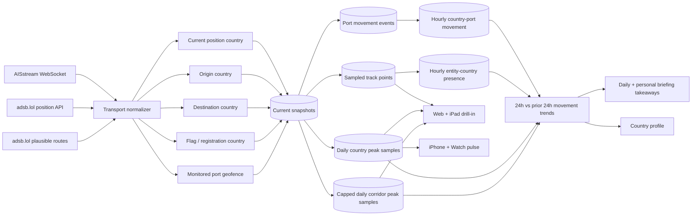

# Transport intelligence

Claritas combines maritime AIS messages and live ADS-B observations into one country-linked movement model. The implementation keeps provider credentials and high-volume ingestion server-side, samples trails before persistence, and gives each client the level of detail appropriate to the device.

## Data flow

Only one API replica holds the PostgreSQL advisory lock for scheduled transport ingestion. This prevents duplicate global WebSocket subscriptions and polling loops while keeping the API itself horizontally scalable. A new rolling-update pod retries lock acquisition every ten seconds until the terminating pod releases the session lock; it cannot permanently start without transport workers after losing the initial race. HTTP refresh requests only bypass the short-lived overview cache; they never launch ingestion work from a request-serving replica.

## Sources and configuration

### AISstream

- Runtime environment variable and GitHub Actions repository secret: `AISSTREAM_API_KEY`.
- Kubernetes secret: `claritas-aisstream`, key `AISSTREAM_API_KEY`.
- `AISSTREAM_ENABLED` is the operational safety switch and defaults to `true`.
- The default is AISstream's documented single global bounding box (`[-90,-180]` to `[90,180]`). `AISSTREAM_BOUNDING_BOXES` can replace it with at most 12 provider-format boxes on that same subscription. Subscription updates replace rather than merge prior coverage, so Claritas does not rotate partial regions.
- “Global” is geographic subscription scope, not complete ocean coverage. AISstream describes the service as beta with no uptime SLA and reports reception roughly 200 km from most coastlines; vessels far offshore and areas without terrestrial stations can be absent.
- `AISSTREAM_SAMPLE_SECONDS` controls current-position sampling and defaults to 600 seconds.
- `AISSTREAM_IDLE_TIMEOUT_SECONDS` defaults to 120 seconds. A connected stream that produces no usable vessel snapshot inside this window is terminated and reconnected; this covers the provider failure mode where a WebSocket remains open but silently stops delivering AIS frames.
- Vessel snapshots drain through one flush at a time, in bounded batches. The production defaults persist at most two 250-vessel batches per five-second cycle, retain newer queued positions while a write is in flight, and requeue failed writes without allowing overlapping flushes to exhaust the database pool.
- MMSI Maritime Identification Digits link a vessel to its flag country. Position-in-country, monitored-port geofences, the first observed voyage country and position, and recognizable AIS destination/UN LOCODE values add current, origin, and destination relationships. When a declared destination resolves to a monitored port, its coordinates are retained so the individual vessel map can draw a route from the first observed position to that port.

### Fintraffic Digitraffic fallback

- The official keyless Digitraffic marine API supplies a secondary AIS position
  and vessel-metadata baseline for Baltic and Northern European waters when the
  global AISstream feed is silent.
- `DIGITRAFFIC_MARITIME_ENABLED` defaults to `true`; production polls the
  `locations` and `vessels` endpoints once per minute with a 15-second request
  timeout and accepts positions observed in the latest 15 minutes.
- Requests use the provider-required compression and application-identification
  headers. Data is attributed to Fintraffic / digitraffic.fi under CC BY 4.0,
  and normalized records retain the source and license in their payload.
- This is an official regional fallback, not a global fallback. Claritas reports
  its Finland/Baltic scope explicitly and never converts a missing regional
  record into evidence that vessel activity stopped.

### Why Marinesia is not an automatic fallback

Marinesia was evaluated in August 2026, but its current official getting-started
guide says every endpoint requires an API key. Its free plan is tightly rate
limited and only exposes a small area sample or a single latest vessel lookup;
bulk/global listings and historical positions require a higher plan. The
provider's official pages currently disagree on some exact free-tier limits,
which is another reason not to build a supposedly keyless availability path on
them. Claritas therefore does not send uncredentialled requests, evade limits,
or represent Marinesia as a free global source. A future integration must use a
server-side key, configured plan limits, licensing review, and explicit provider
attribution.

### adsb.lol

- No API key is required.
- `ADSB_LOL_POLL_ENABLED` enables scheduled collection and defaults to `true`.
- `ADSB_LOL_POLL_SECONDS` defaults to 600 seconds.
- `ADSB_LOL_MAX_ROUTE_LOOKUPS` limits plausible route candidates per cycle and defaults to 750. Candidates are sampled proportionally across currently observed countries, then resolved against adsb.lol's CDN-backed standing-route records so early polling areas cannot consume the global budget. Successful and unknown callsigns are cached for 20 minutes; repeated provider failures open a short circuit breaker instead of delaying the whole refresh.
- `ADSB_LOL_POLL_POINTS` can override the built-in global hub grid with JSON objects containing `label`, `lat`, `lon`, and a radius of at most 250 nautical miles.
- `ADSB_LOL_USER_AGENT` should identify the deployment and a monitored contact.

adsb.lol describes its public API as free and keyless today, distributes its data under ODbL 1.0, and asks production users to contact the project so service changes do not unexpectedly break an application. Production ownership should therefore include provider coordination and monitoring.

## Country linkage

Each current snapshot may carry multiple explicit country roles:

| Role | Maritime basis | Aviation basis |
| --- | --- | --- |
| Current | Monitored-port geofence, otherwise the Natural Earth polygon containing the AIS position | Natural Earth polygon containing the ADS-B position |
| Origin | First observed country before a declared destination | Origin airport returned with a plausible route |
| Destination | AIS destination interpreted as UN LOCODE, port, or country | Destination airport returned with a plausible route |
| Flag / registration | ITU-R M.585 MMSI MID | Registration identifier when available |

Country aggregates count unique vehicles per role. A single vehicle is counted once in a country's total even when it has several roles for that country. Maritime corridors fall back to flag-to-destination when a defensible origin has not yet been observed; route aggregates expose whether their origin is observed, a flag fallback, or mixed. The country-connection tooltip and corridor list label proxy evidence instead of presenting that link as an exact port-to-port voyage.

## Movement history, trends, and takeaways

Claritas compares the latest 24 hours with the preceding 24 hours:

- A ship departure is recorded once when a current vessel snapshot leaves one of the monitored port geofences. An arrival is the inverse transition. These immutable transition events replace repeated window-function scans over raw tracks.
- Cargo-vessel flow counts departures from AIS ship categories `cargo` and `tanker`. It is a movement proxy only. AIS does not disclose cargo tonnage, vessel load, trade value, or complete port-authority movement totals.
- Flight activity counts unique aircraft with a current, origin, or destination country link in each window. Coverage depends on configured poll areas and upstream ADS-B reception.
- Percentage change is `(current - previous) / previous`. When the previous window is zero, the API labels non-zero activity as a new baseline instead of manufacturing a percentage.

The API returns both the underlying current/previous values and concise, qualified takeaways. Web and iPad show the full port and trend detail. When a country is selected, the web workspace derives country-linked live totals, resolved arrivals and departures, current-position count, strongest counterpart, network reach, and origin/destination coverage from the same scoped response. Selecting a resolved counterpart then narrows those aggregates to the two-way corridor: total active movements, each direction, mode mix, share of the country's resolved network, and observed versus flag-proxy origin evidence. iPhone and Watch show the takeaways without raw vehicle data. Country profiles use the country-scoped trend, while daily and personal briefings receive the same data and methodology notes as evidence for generation.

The web deep dive also exposes 7-, 30-, and 90-day daily series from Claritas'
own persisted observations. `transport_country_activity_day` stores daily peak
sampled country-linked activity for the 100-day history window, while
`transport_movement_hour` supplies monitored-port arrivals and departures for
the same 100-day bounded history window.
`transport_corridor_activity_day` stores daily peak sampled activity per
mode/country pair and keeps observed-origin and maritime flag-proxy counts
separate. It admits at most the first 1,000 encountered pairs per mode/day,
prioritising higher-volume pairs only within each ingestion flush, and retains
100 days. Later pairs can be omitted regardless of volume, creating an
early-cycle sampling bias; this is sampled coverage rather than a complete
global corridor ranking. The default
corridor history is capped at 200,000 compact rows rather than expanding
per vehicle/hour. Country history adds fewer than 50,000 rows at the same
retention. Both histories start prospectively at V44, without scanning or
seeding from the production raw-track table during rollout. Charts leave
unobserved days empty rather than displaying false zero traffic and state the
actual first/last date, observed-day count, source mix, and retention policy.

## API

- `GET /api/transport/overview?country=SE&detail=aggregate` returns country-scoped KPIs, linked-country and corridor aggregates, 24-hour trend comparisons, qualified takeaways, monitored-port movement, hourly activity, freshness, and source coverage. `country` is a required ISO alpha-2 code for every interactive client request.
- `GET /api/transport/overview?country=SE&detail=full` adds current flight and vessel records for web and iPad. Optional `mode` and `entity_limit` filters apply consistently to aggregates and details. Corridor results include only routes whose resolved origin or destination is the selected country, while the broader entity result retains explicit current/flag/registration linkage.
- `GET /api/transport/overview?country=SE&corridor=FI&detail=full` adds a two-way SE–FI historical corridor series while preserving the selected country's live relationship context. `corridor` must be a different ISO alpha-2 code.
- `GET /api/transport/entities/:mode/:entityId` returns the current normalized record and up to 24 hours of sampled track points.

All endpoints use the same authenticated paid-access boundary as the other Claritas intelligence domains. The AISstream credential is never returned to a client. Runtime coverage reports distinguish disabled, connecting, reconnecting, receiving, and live states, plus message, accepted-snapshot, persisted-snapshot, queue, drop, malformed-frame, subscription-batch, primary-source, fallback-source, and write-error diagnostics. This separates a configured but silent upstream stream from parsing or database persistence failures and shows whether the official regional fallback is active. Web, iPhone, and iPad resolve an explicit selection first and otherwise use the same highest-relevance country highlighted by the cross-source signal map; Watch uses that same highlighted-country fallback. Interactive clients never request a global overview. Equivalent country overview requests are coalesced and cached for 120 seconds per API replica. Overview refreshes run at most two database reads concurrently, and maritime comparisons read the hourly movement aggregate instead of rescanning event history. Briefing generation retains a private aggregate-only global ranking path because its purpose is to compare country activity; it never loads raw entities, and a transient read failure uses the last successful aggregate when available, or an explicit empty transport context, without blocking the other briefing sources or email delivery.

## Presentation contract

- Web and iPad show current vehicles on a 50m-detail base map, exact route curves when endpoint coordinates are available, and non-directional country-connection bands for every resolved corridor in the active country scope. Blue bands identify flight connections and orange bands identify shipping connections; opposite-direction aggregates collapse into one band per mode, while the band width communicates active volume. Arrowheads are reserved for individual aircraft and vessel routes, so direction always refers to a live vehicle rather than an aggregate relationship. Country selection filters markers to explicitly linked vehicles, gives each one a visible linkage ring, summarizes the strongest counterpart, resolved direction totals, current-position count, network reach, and route quality, and replaces the empty detail rail with a selectable list that states whether every vehicle is inbound, outbound, currently present, or linked by flag/registration. A counterpart can be selected from the strongest-country aggregate, the corridor control, the country table, a corridor row, or a connected map node. The resulting two-country view reports the total and both directions, filters route aggregates and selectable vehicles to that pair, and keeps proxy-origin qualifications visible. Selecting a vehicle directly on the map or in the list focuses the map, keeps its marker size usable at deep zoom, refreshes its live position and sampled 24-hour trail, and exposes its flight number or MMSI and country chain. Country scope returns to a fitted view of all visible connection endpoints. Trend takeaways, monitored-port movement, a 24-hour activity chart, most-connected-country bars, corridor flows, and a dense identifier table remain available below the map.
- iPhone shows only KPIs, qualified trend takeaways, leading countries, and leading corridors. It does not receive raw vehicles or track points during normal app bootstrap.
- Watch shows only aggregate flight/vessel/country counts, a qualified takeaway, an aggregate country bubble map, and the leading corridor, with a handoff to the iPhone transport section.

Freshness windows are 20 minutes for aviation and two hours for maritime snapshots. Historical track points are sampled at ten-minute resolution and retained for three days. Current snapshots are retained for 14 days after their last observation; movement events and detailed per-entity country presence retain 60 days, while compact port-hour movements and capped daily country/corridor aggregates retain 100 days. The advisory-lock owner prunes expired rows every three hours using one shared batch and 30-second wall-clock budget. It rotates unfinished tables to the front of the next pass and reports backlog state through its deployment-local runtime health route, so catch-up cannot overlap or monopolize the API pool.

The operational defaults are documented in [Cloud SQL capacity and transport load](operations/cloud-sql-capacity.md).
